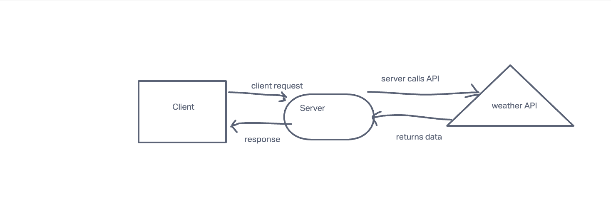

# city-explorer-api

**Author**: Bishal 

# Overview

In this lab assignment, you will begin building your own custom API server, which will provide data for the City Explorer front-end application. This means users will get to see not only the map, but also interesting information about the area, provided by a variety of third-party APIs that your server will manage.

# WRRC ( Web Request Resonse Cycle)

# Time Est

Name of feature: Custom Servers with Node and Express

Estimate of time needed to complete: 5 hours

Start time: 3:30 pm

Finish time: 11:30 pm

Actual time needed to complete: 8 hours

